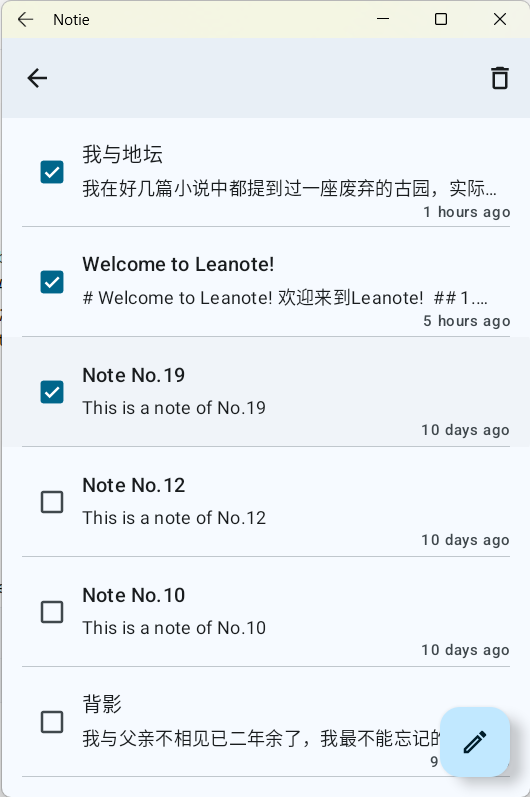
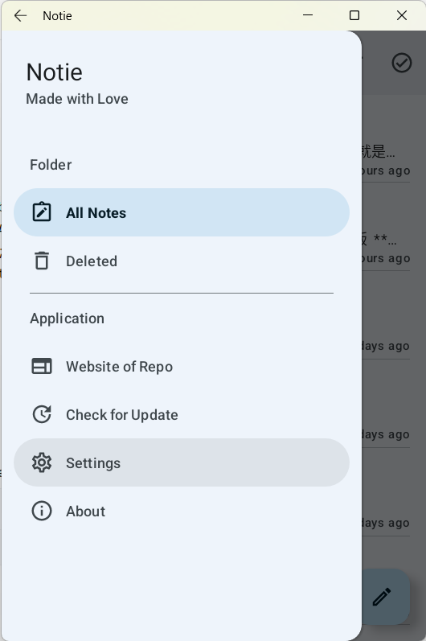
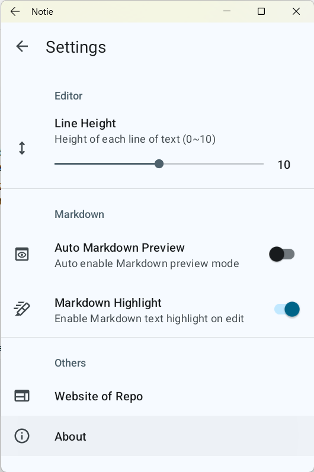
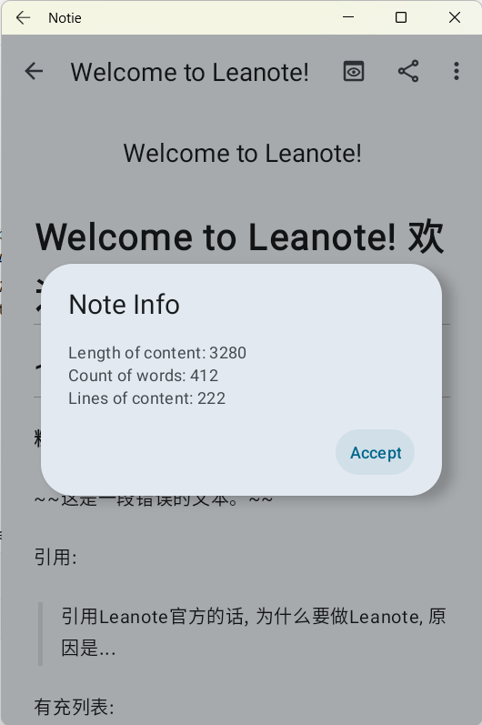
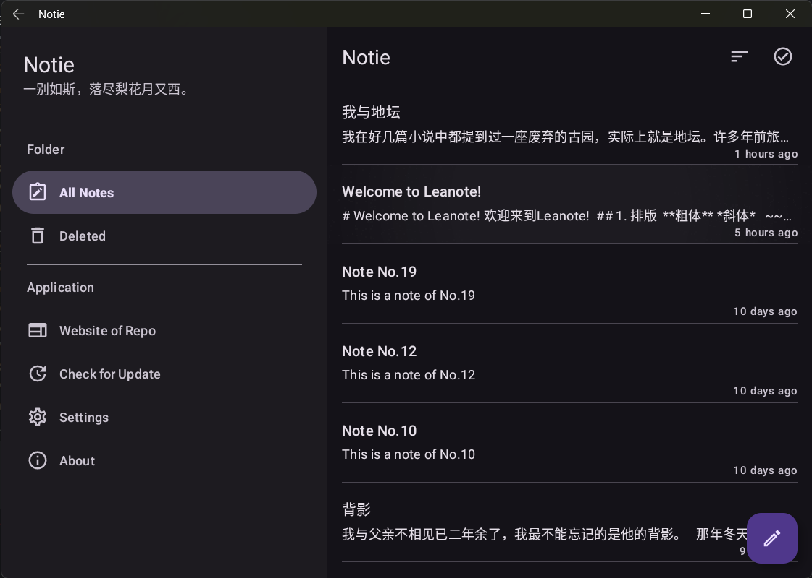
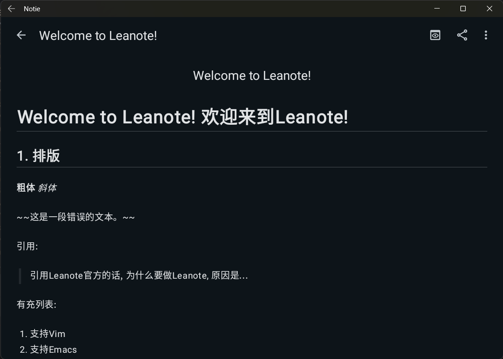
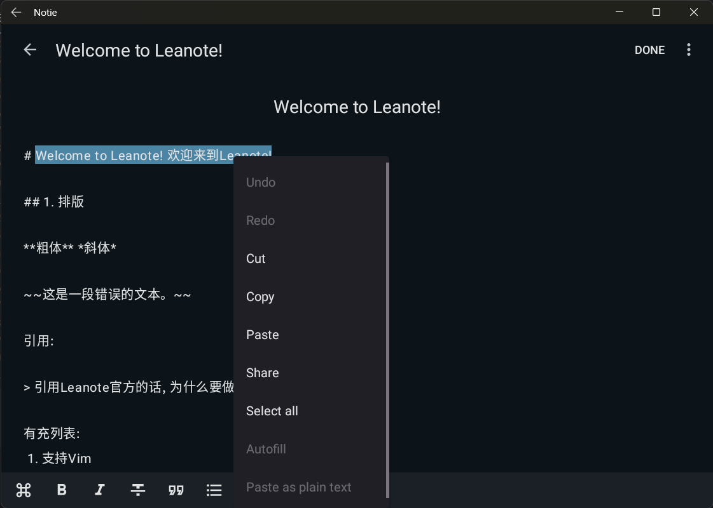

# Notie

[](https://github.com/cworld1/notie/stargazers)
[](https://github.com/cworld1/notie/commits)
[](https://github.com/cworld1/notie/releases/latest)
[](https://github.com/cworld1/notie/blob/main/LICENSE)

Android note App complies with Material You specifications, developed using Java.

| Screenshot                       | Screenshot                     |
| -------------------------------- | ------------------------------ |
|  |  |
|   |  |







## Local Development

Environment requirements:

- [SDK](https://developer.android.com/tools/releases/platforms): Android 14.0 ("UpsideDownCake")

  - Android SDK Platform 34
  - Sources for Android 34
  - Google APls Intel x86_64 Atom System Image

- [Android Gradle Plugin Version](https://developer.android.com/build/agp-upgrade-assistant): 8.1.4

- Gradle Version: 8.0

### 1. Clone the repository

```shell
git clone https://github.com/cworld1/notie.git
cd notie
```

### 2. Open the code using Android Studio

```shell
studio64 .
```

## Contributions

To spend more time coding and less time fiddling with whitespace, this project uses code conventions and styles to encourage consistency. Code with a consistent style is easier (and less error-prone!) to review, maintain, and understand.

### Be consistent

If the style guide is not explicit about a particular situation, the cardinal rule is to **be consistent**. For example, take a look at the surrounding code and follow its lead, or look for similar cases elsewhere in the codebase.

### Java

Follow the [Google Java Style Guide](https://google.github.io/styleguide/javaguide.html).

### XML

- 2 space indentation
- Resource naming (including IDs) is `lowercase_with_underscores`
- Attribute ordering:
  1.  `xmlns:android`
  2.  other `xmlns:`
  3.  `android:id`
  4.  `style`
  5.  `android:layout_` attributes
  6.  `android:padding` attributes
  7.  other `android:` attributes
  8.  `app:` attributes
  9.  `tool:` attributes

## License

This project is licensed under the GPL 3.0 License.
